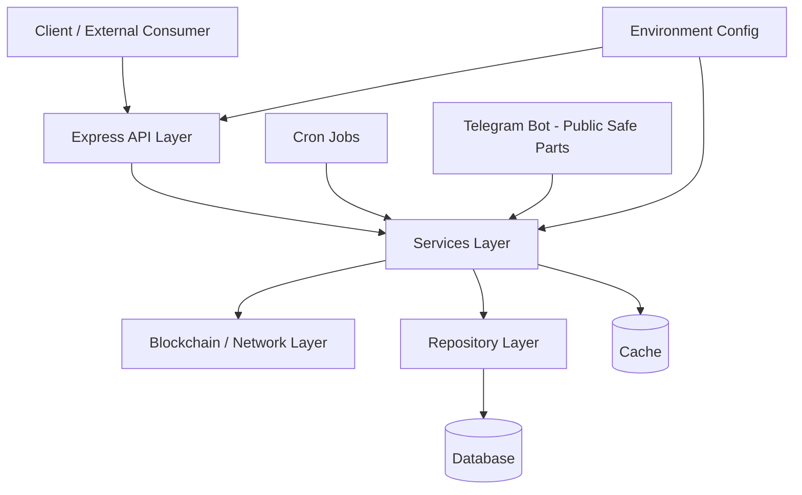

# CryPrice Backend Public Export

## Purpose

This repository contains a **public, sanitized, and demonstrative** snapshot of the CryPrice backend codebase. It is intended for:

- **Code review** and architecture discussion without access to closed systems;
- **Portfolio** use and illustrating experience with backend / Web3 integrations;
- **Architecture demos** of a layered Node.js application (HTTP API, background jobs, persistence, caching);
- **Approach demos**: modular services, repositories, middleware, environment-driven configuration;
- **Public development** of only those product areas that are safe to open-source.

This export is **not** a full replica of any production deployment and **does not** include proprietary operational or commercial logic.

## Source Project

The public tree was derived from a **private CryPrice backend project**. The private repository and its contents are **not** part of this public repo and are not distributed here. The relationship is one-way: a filtered copy was produced from the private codebase for publication (e.g. on GitHub).

## Public Repository Scope

Only **public-safe** backend code lives here: data shapes and services needed to illustrate monitoring of DeFi positions (e.g. Aave), prices, Health Factor, a REST API, and (in a reduced form) a Telegram bot.

The following capability classes are **deliberately omitted or not documented** in the open version:

- User administration and operator-only workflows;
- Payments and payment-adjacent flows;
- Commercial subscriptions, tier upgrades, and subscription-based access control;
- Production infrastructure specifics, internal URLs, and secrets;
- Operational artifacts such as dumps, logs containing sensitive data, or real `.env` files;
- Auxiliary SQL / verification scripts that are not needed to understand the public architecture.

The `.env.example` file contains **placeholders only**; real keys and passwords must never be committed.

## Application Architecture

The layers below reflect the **actual** layout under `src/` in this repository.

### API Layer (`src/api/`)

- The **Express** app is wired in `server.js`: routes for prices, assets, networks, health, and authentication; JSON body parsing; CORS; proxy trust settings.
- **Routes** (`routes/`): `health`, `assets`, `onchainPrices`, `offchainPrices`, `network`, `auth`.
- **Middlewares** (`middlewares/`): rate limiting for API and `/auth`, error handling, JWT verification for protected endpoints.
- **Errors** (`errors/`): typed HTTP errors for consistent responses.

### Application Layer (`src/app/`, `src/index.js`)

- Process entrypoint: `src/index.js` loads environment configuration and starts the application.
- **`index.js` (app)** connects Redis (via the Redis client layer), then runs bootstrap and runtime.
- **`bootstrap.js`**: database initialization and sequential startup loading for networks, users, assets, prices, wallets, and ABI bootstrap services.
- **`runtime.js`**: starts cron jobs, the Telegram bot, and the HTTP server **in the same process**.

### Services Layer (`src/services/`)

Business logic retained in the public export (excluding closed admin / payments / subscription modules):

- **`asset/`**, **`network/`**, **`price/`** (on-chain/off-chain ingestion and normalization), **`positions/`**, **`healthfactor/`** (HF calculation and synchronization).
- **`wallet/`**, **`user/`** — users and wallets under a demonstration-oriented model (wallet caps come from environment configuration, not commercial tiers).
- **`auth/`**, **`jwt.tokens.js`** — Google ID token verification → user provisioning + access/refresh issuance when the corresponding env vars are set.
- **`ai/`** — optional replies via an external AI API for bot flows (only when a key is supplied via env; no secrets are stored in the repo).
- **`bootstrap*.service.js`** files — startup hydration into cache/DB.

**Not included in this public export:** a separate module for broadcast price alerts segmented by paid tiers (that directory is absent from the tree).

### Blockchain / Network Layer (`src/blockchain/`)

- **`networks.config.js`** (under `src/config/`) binds chain settings to **environment variables** (RPC endpoints, protocol provider addresses, explorer API settings — no hard-coded secrets).
- **`adapters/`**, including **Aave** — protocol reads for positions and risk metrics.
- **`networks/`** — per-chain modules (Ethereum, Arbitrum, Avalanche, Base, etc., as present in subdirectories).
- **`abi/`** — ABI registry and loading (including explorer API calls keyed from env), plus local ABI fragments where shipped in-repo.
- **`helpers/`** — shared helpers (e.g. Health Factor, token metadata).

### Data Access Layer (`src/db/`)

- **`connection.js`**, **`postgres.client.js`**, **`db.client.js`**, **`index.js`** — PostgreSQL pooling and repository façade.
- **`init.js`** — application DDL on startup (tables and indexes). The public export **does not** create database objects related to pending payments (those constructs were removed).
- **`migrate*.js`** — schema preparation/migrations (off-chain prices, auth, internal user ids, etc.), invoked from initialization.
- **`repositories/`** — repositories for users, wallets, networks, assets, prices, health factors, refresh tokens, auth identities, and related entities.

**Not included:** a standalone operational verify-SQL directory under `src/db/` (absent from this tree).

### Cache Layer (`src/cache/`, `src/redis/`)

- Redis client: `src/redis/redis.client.js`.
- Domain caches for users, wallets, prices, assets, ABI, rate limits, etc. (`src/cache/*.js`). Redis dumps and runtime cache files are not part of the repository.

### Cron / Background Jobs Layer (`src/cron/`)

- Central scheduling registration in `cron/index.js`.
- Jobs refreshing assets, on-chain/off-chain prices, and Health Factor (`*Updater.cron.js`, `priceUpdater.cron.js`, etc.).
- In the public export, cron **does not** invoke the removed broadcast price-alert layer tied to paid audience segments.

### Bot Layer (`src/bot/`) — present, sanitized

- **`bot.js`**, **`bot.instance.js`** — Telegraf setup, sessions, add/remove-wallet scenes.
- **`commands/`** — user-facing commands (start, profile, help, positions, HF, threshold, support as a **static notice**, `/add_wallet` for wallet onboarding).
- **`handlers/`** — wallet flows, ticker-style price interactions, errors, optional AI text handling.
- **`scenes/`** — add/remove wallet scenes.
- **`guards/`** — only the **rate-limit** guard is exported publicly (admin-only guards were removed).
- **`locales/`**, **`keyboards/`**, **`utils/`**, **`notification.service.js`** — formatting and outbound messaging retained for the demonstration scope.

**Removed relative to the full private codebase:** commands and handlers for administration, operator user directories, tier upgrades, and similar flows (they do not exist as files here).

### Configuration Layer (`src/config/`)

- **`env.js`** — reads **only** `process.env` (API port, database URL, bot token, Redis, JWT/Google/Gemini-related settings, etc.). No real secret values are embedded in source.
- **`networks.config.js`** — maps chain configuration to environment variables.

---

## Architecture Diagram

The diagram summarizes data/control flow without concrete URLs, credentials, or production topology.

