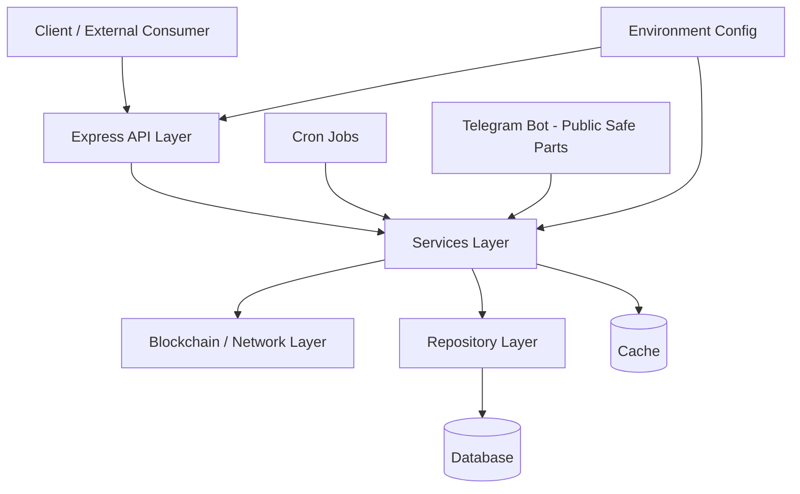

# CryPrice Backend

## Overview

This repository is the **CryPrice** backend: a Node.js service for **DeFi-oriented monitoring** (e.g. Aave-oriented reads), **Health Factor** tracking, **on-chain and off-chain prices**, wallet-linked flows, and a **REST API**. It ships as a **public-safe** snapshot—suitable for **architecture demos**, **portfolio review**, and collaboration on **non-sensitive** parts of the system.

It is **not** a full production replica: proprietary operational logic stays outside this tree. For export provenance and sanitizing notes, see [`PUBLIC_EXPORT.md`](PUBLIC_EXPORT.md).

## Features

Capabilities present in **this** public repository:

- **Public-safe Express API** — routing in `src/api/server.js`; JSON body parsing, CORS, proxy trust.
- **Health check** — `/health` (see `src/api/routes/health.route.js`).
- **Assets and networks** — `/assets`, `/networks` backed by services and repositories under `src/services/` and `src/db/repositories/`.
- **On-chain and off-chain prices** — `/prices/current/onchain`, `/prices/current/offchain` and related price services under `src/services/price/`.
- **Blockchain / protocol adapters** — `src/blockchain/` (per-chain modules, Aave-oriented adapter layer, ABI loading keyed from environment).
- **Repository layer and PostgreSQL client** — `src/db/` (`connection.js`, `postgres.client.js`, `repositories/`).
- **Redis-backed cache abstractions** — `src/redis/redis.client.js`, domain caches under `src/cache/`.
- **Cron / background jobs** — `src/cron/` (asset and price refresh jobs, Health Factor updater wiring).
- **Telegram bot (sanitized)** — `src/bot/` with Telegraf: user commands, wallet scenes, HF/positions helpers, optional AI prompt handling when configured via env.

Optional **Google Sign-In + JWT** session API exists under `/auth/*` when the corresponding env vars are set (see [`docs/AUTH.md`](docs/AUTH.md)).

## Tech Stack

From `package.json` and project layout:

| Area | Technology |
|------|------------|
| Runtime | **Node.js** (ES modules, `"type": "module"`) |
| HTTP API | **Express** 5.x, **cors**, **express-rate-limit** |
| Database | **PostgreSQL** via **`pg`** |
| Cache | **Redis** via **`ioredis`** |
| Scheduling | **`node-cron`** |
| Blockchain | **`ethers`** v6; RPC/explorer settings from env (`src/config/networks.config.js`) |
| Telegram | **Telegraf** |
| Auth | **google-auth-library**, **jsonwebtoken** |
| Optional AI (bot) | **`@google/genai`** |
| HTTP client (ABI/explorer paths) | **`node-fetch`** |
| Concurrency helpers | **`p-limit`** |
| Config | **`dotenv`**; **`src/config/env.js`** reads `process.env` only |

Dev tooling includes TypeScript types for Node/Express (`devDependencies`); the app runs as **JavaScript** (`src/index.js`).

## Architecture

The layers below match the **actual** layout under `src/` in this repository.

### Architecture Diagram

High-level flow (no concrete URLs, secrets, or production topology):



### API layer (`src/api/`)

- **`server.js`** wires the Express app: routes for prices, assets, networks, health, and authentication; JSON parsing; CORS; proxy trust.
- **`routes/`**: `health`, `assets`, `onchainPrices`, `offchainPrices`, `network`, `auth`.
- **`middlewares/`**: API and `/auth` rate limiting, error handling, JWT verification for protected routes.
- **`errors/`**: typed HTTP errors for consistent responses.

### Application layer (`src/app/`, `src/index.js`)

- **`src/index.js`** loads environment configuration and starts the application.
- **`app/index.js`** connects Redis, then runs bootstrap and runtime.
- **`bootstrap.js`**: DB initialization and sequential startup hydration (networks, users, assets, prices, wallets, ABI bootstrap services).
- **`runtime.js`**: starts cron jobs, the Telegram bot, and the HTTP server in one process.

### Services layer (`src/services/`)

- **`asset/`**, **`network/`**, **`price/`** (on-chain/off-chain ingestion and normalization), **`positions/`**, **`healthfactor/`**.
- **`wallet/`**, **`user/`** — users and wallets; wallet caps are driven by configuration (see `.env.example`), not by modules removed from this export.
- **`auth/`**, **`jwt.tokens.js`** — Google ID token verification and access/refresh issuance when env is configured.
- **`ai/`** — optional bot replies via external AI when an API key is supplied via env only.
- **`bootstrap*.service.js`** — startup hydration into cache/DB.

A separate **broadcast price-alert fan-out** module directory is **not** present in this tree.

### Blockchain / network layer (`src/blockchain/`)

- Chain settings are bound to **environment variables** via `src/config/networks.config.js` (RPC, protocol addresses, explorer API parameters—no hard-coded secrets).
- **`adapters/`** — protocol reads (including **Aave**).
- **`networks/`** — per-chain modules (Ethereum, Arbitrum, Avalanche, Base, etc., as subdirectories exist).
- **`abi/`** — ABI registry/loading (explorer calls use env-supplied keys); local ABI fragments where committed.
- **`helpers/`** — e.g. Health Factor helpers, token metadata.

### Data access layer (`src/db/`)

- **`connection.js`**, **`postgres.client.js`**, **`db.client.js`**, **`index.js`** — pooling and repository façade.
- **`init.js`** — DDL on startup. Constructs related to **pending payments** were removed from this export’s initialization path.
- **`migrate*.js`** — schema preparation invoked during init (off-chain prices, auth-related columns/tables, internal user id migration, etc.).
- **`repositories/`** — users, wallets, networks, assets, prices, health factors, refresh tokens, auth identities, etc.

A standalone **`src/db/verify/`** SQL bundle is **not** included here.

### Cache layer (`src/cache/`, `src/redis/`)

- **`redis/redis.client.js`** — Redis connection.
- **`cache/*.js`** — domain caches (users, wallets, prices, assets, ABI, rate limits, etc.). Redis dumps and runtime cache files are not part of the repo.

### Cron / background jobs (`src/cron/`)

- **`cron/index.js`** registers schedules.
- Jobs refresh assets, on-chain/off-chain prices, and Health Factor (`*Updater.cron.js`, `priceUpdater.cron.js`, etc.). They do **not** invoke the removed broadcast alert module referenced above.

### Bot layer (`src/bot/`)

- **`bot.js`**, **`bot.instance.js`** — Telegraf, sessions, add/remove-wallet scenes.
- **`commands/`**, **`handlers/`**, **`scenes/`** — user-facing flows (profile, positions, HF, threshold, `/add_wallet`, etc.).
- **`guards/`** — rate-limit guard only in this export.
- **`locales/`**, **`keyboards/`**, **`utils/`**, **`notification.service.js`** — UX and outbound messaging for retained flows.

### Configuration layer (`src/config/`)

- **`env.js`** — reads **`process.env` only** (API port, `DATABASE_URL`, `BOT_TOKEN`, Redis, JWT/Google/Gemini-related settings). No embedded secrets.
- **`networks.config.js`** — maps chains to env-driven settings.

---

## Requirements

- Node.js **20+** recommended  
- **PostgreSQL**  
- **Redis**  
- Env placeholders filled from **`.env.example`** (`DATABASE_URL`, `BOT_TOKEN`, RPC/explorer-related vars, optional Google/JWT/Gemini)

## Getting started

```bash
cp .env.example .env
# Edit .env — never commit real secrets.

npm install
npm run build
npm test
npm start
```

`npm start` connects Redis, applies DDL/migrations from `src/db/init.js`, starts cron jobs, the Telegram bot, and the HTTP API on **`PORT_API`** (default **3000**).

## REST API (selection)

| Prefix | Purpose |
|--------|---------|
| `/health` | Liveness |
| `/assets` | Indexed assets |
| `/prices/current/onchain`, `/prices/current/offchain` | Latest prices |
| `/networks` | Enabled chains |
| `/auth/*` | Google sign-in + JWT when configured (`docs/AUTH.md`) |

Rate limiting is applied per route groups in `src/api/server.js`.

## Telegram bot

User-facing flows include wallets (including scenes), Health Factor and positions helpers, thresholds, and optional **`ai:`** prompts when Gemini env vars are set. **`/support`** shows a **static notice** only (no operator relay in this repository).

## Security

- Do **not** commit `.env` or production credentials.
- Rotate any credential that may have leaked.
- Scope RPC and explorer keys in provider dashboards where supported.

## License

See [`LICENSE`](LICENSE).
